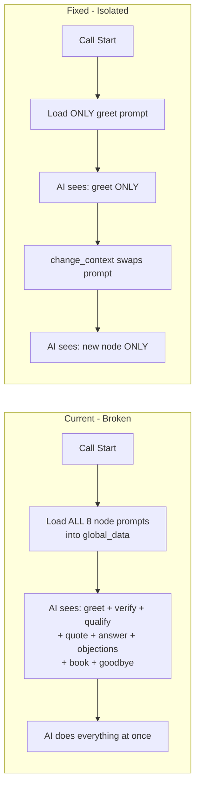

# Context Isolation and Token Fix Plan

## Problem Summary

The agent is hallucinating because it sees **all 8 node instructions simultaneously** at call start. The AI isn't disobedient - it's doing exactly what it's told it can do across all nodes.



---

## Changes Required

### Step 1: Remove All-Node Loading from on_swml_request

**File:** [`barbara/barbara_agent.py`](barbara/barbara_agent.py) (lines 528-563)

**Current code to REMOVE:**

```python
for node_name in ALL_NODES:
    cfg = get_node_config(node_name, "reverse_mortgage") ...
    node_prompt_data[f"node_instructions_{node_name}"] = instructions
    
self.set_global_data(node_prompt_data)
logger.info("[BARBARA] Loaded 8 node instruction prompts into global_data")
```

**Replace with:** Load ONLY the starting context ("greet") instructions:

```python
# Load ONLY starting context instructions (not all 8)
starting_context = "greet"
cfg = get_node_config(starting_context, "reverse_mortgage") or get_fallback_node_config(starting_context)
starting_instructions = cfg.get("instructions", "Greet the caller warmly.")

# Replace placeholders with actual values
for placeholder, value in placeholder_values.items():
    starting_instructions = starting_instructions.replace(placeholder, str(value))

self.set_global_data({
    f"node_instructions_{starting_context}": starting_instructions,
    "current_context": starting_context
})
logger.info(f"[BARBARA] Loaded ONLY '{starting_context}' instructions (isolated)")
```

**Note on feedback suggestion:** The external review suggested NOT storing instructions in global_data at all (since "global_data = facts, not rules"). However, we MUST store them there because:

1. `_build_contexts()` sets step text to `${global_data.node_instructions_X}` placeholder
2. This placeholder needs to resolve when the context activates
3. This is the SDK's intended pattern for dynamic prompts

The key fix is loading ONE node instead of EIGHT, not eliminating global_data usage entirely.

---

### Step 2: Make change_context a HARD Prompt Swap (SDK-Correct Approach)

**File:** [`barbara/barbara_agent.py`](barbara/barbara_agent.py) (lines 1335-1342)

**Current code:**

```python
def change_context(self, args, raw_data):
    context_name = args.get("context_name", "")
    return SwaigFunctionResult(f"Switching to {context_name}").swml_change_context(context_name)
```

**Why NOT use `.switch_context(system_prompt)`:**

Per SDK docs and external feedback, `.switch_context(system_prompt=...)` is risky because it:

- Replaces the entire system prompt WITHOUT re-applying theme/guardrails
- Breaks tool scoping (tools are tied to pre-defined context objects)
- May cause token invalidation

**SDK-Supported Solution:** Chain `.update_global_data()` with `.swml_change_context()`

Per SDK manual line 23314-23315, this pattern is explicitly supported:

```python
result.update_global_data(global_data)
result.swml_change_step("taking_order")
```

**Replace with:**

```python
def change_context(self, args, raw_data):
    context_name = args.get("context_name", "")
    phone = raw_data.get("conversation_id", "")
    
    # Lazy-load: fetch ONLY this node's instructions from DB
    cfg = get_node_config(context_name, "reverse_mortgage") or get_fallback_node_config(context_name)
    instructions = cfg.get("instructions", f"Continue in {context_name} stage.")
    
    # Get caller context for placeholder replacement
    lead = get_lead_by_phone(phone)
    conv_state = get_conversation_state(phone)
    
    # Build placeholder values (same as on_swml_request)
    placeholder_values = self._build_placeholder_values(lead, conv_state, phone)
    for placeholder, value in placeholder_values.items():
        instructions = instructions.replace(placeholder, str(value))
    
    logger.info(f"[BARBARA] change_context: switching to '{context_name}' with fresh instructions")
    
    # SDK-correct: Update global_data THEN switch to pre-defined context
    # This preserves tool scoping from _build_contexts() while isolating instructions
    #
    # PARANOID CLEANUP: Use SDK's .remove_global_data() to clear ALL other node
    # instructions. This prevents stale data, SDK caching edge cases, or prompt bleed.
    # Per SDK manual line 18227: remove_global_data(keys) removes keys from global data
    # 
    # Uses ALL_NODES constant (already defined at module top) to avoid hardcoding
    keys_to_remove = [f"node_instructions_{n}" for n in ALL_NODES if n != context_name]
    
    return (
        SwaigFunctionResult(f"Switching to {context_name}")
        .remove_global_data(keys_to_remove)  # SDK method - cleaner than setting None
        .update_global_data({
            f"node_instructions_{context_name}": instructions,
            "current_context": context_name
        })
        .swml_change_context(context_name)
    )
```

**Why this works:**

1. **Tool scoping preserved**: Pre-defined context from `_build_contexts()` has `step.set_functions()`
2. **Instructions isolated**: Only new node's instructions in global_data
3. **Theme preserved**: Not overwritten (we're not using raw `.switch_context()`)
4. **Placeholder `${global_data.node_instructions_X}` resolves**: Because we just set it

**Also add helper method:**

```python
def _build_placeholder_values(self, lead: dict, conv_state: dict, phone: str) -> dict:
    """Build placeholder replacement map for prompt injection."""
    return {
        "${global_data.call_direction}": conv_state.get("call_direction", "inbound"),
        "${global_data.caller_name}": lead.get("first_name", "there") if lead else "there",
        "${global_data.caller_phone}": phone,
        # ... other placeholders ...
    }
```

---

### Step 3: Verify Tool Scoping Per Context

**File:** [`barbara/barbara_agent.py`](barbara/barbara_agent.py) (lines 804-805)

The current code already scopes tools per context:

```python
if functions:
    step.set_functions(functions)
```

**Action:** Audit the database to ensure:

- `greet` node does NOT have `calculate_reverse_mortgage` in its functions list
- `verify` node does NOT have `calculate_reverse_mortgage`
- `qualify` node does NOT have `calculate_reverse_mortgage`
- ONLY `quote` node has `calculate_reverse_mortgage`

Use Supabase MCP to verify:

```sql
SELECT node_name, content->'functions' as functions 
FROM prompt_versions pv
JOIN prompts p ON p.id = pv.prompt_id
WHERE p.vertical = 'reverse_mortgage' AND pv.is_active = true
ORDER BY node_name;
```

---

### Step 4: Investigate Token Invalidation (NOT Secondary)

The logs show repeated warnings:

```
WARNING agent_base invalid_token (agent=barbara, endpoint=post_prompt, ...)
WARNING agent_base token_invalid (agent=barbara, endpoint=swaig, function=change_context, ...)
```

**Why this matters (per external review):**

> "These warnings are **not benign**. They are often caused by singleton agent reuse, context switch mid-turn, or mismatched function-context lifecycle. This amplifies hallucinations because the model thinks 'I tried, nothing happened, I'll just continue.'"

**Root cause hypothesis:** Per-function tokens are generated at call setup and may become stale when context switches occur. The model's tool call succeeds server-side but the confirmation token doesn't match, causing the model to think nothing happened.

**Actions:**

1. **After isolation fix:** Monitor if token warnings decrease
2. **Check for `secure=True`:** Search tool definitions (shouldn't be set for internal tools)
3. **Singleton cleanup:** Verify `clear_post_answer_verbs()` and section filtering in `on_swml_request` is sufficient
4. **Add assertion logging:** Log when tool succeeds but token validation fails

**File to check:**

```python
grep -n "secure=True" barbara/barbara_agent.py
```

**Expected outcome:** Instruction isolation will dramatically reduce token invalidation frequency. If it persists after isolation, we'll need to investigate the singleton lifecycle more deeply.

---

## Testing Protocol

After implementing Steps 1-3:

1. **Single outbound call test**

   - Trigger call via MCP
   - Check logs for: `Loaded ONLY 'greet' instructions (isolated)`
   - Verify NO 8-node loading message appears

2. **Context transition test**

   - Go through greet -> verify -> qualify flow
   - Check logs for: `change_context: switching to 'X' with fresh instructions`
   - Verify AI behavior resets at each boundary

3. **Tool availability test**

   - In GREET context, AI should NOT have access to `calculate_reverse_mortgage`
   - In QUOTE context, AI SHOULD have access

4. **Hallucination test**

   - AI should NOT mention dollar amounts until QUOTE context
   - AI should NOT attempt booking until BOOK context

---

## Rollback Plan

If this fails, revert to the previous commit (current state is clean):

```bash
tried to git revert HEAD
```

The database routing changes are separate and can stay as-is.